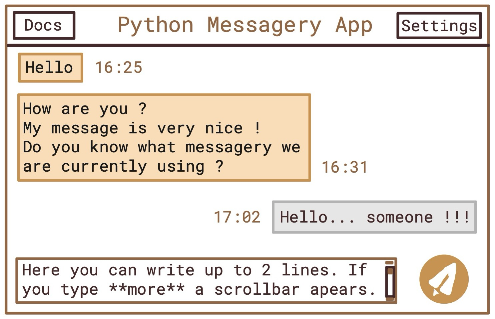
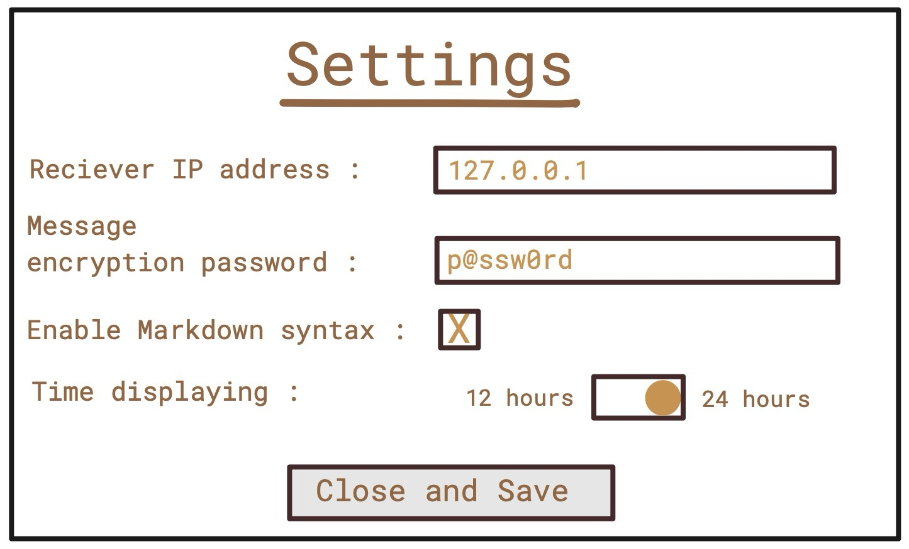
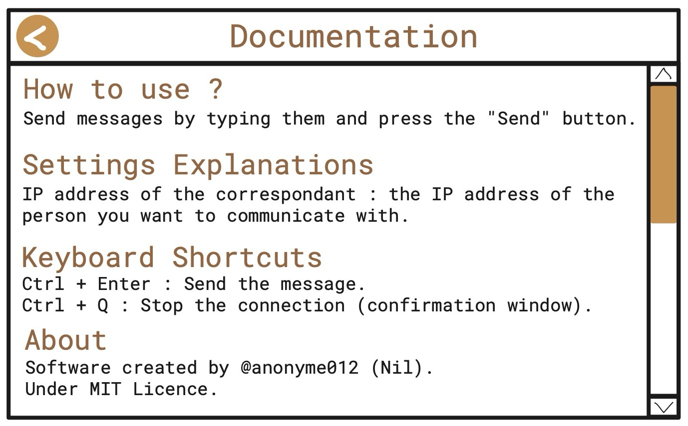

# Messagery Documentation

A GUI interface to send text messages through Internet between 2 users.

## Features
- Text messages only
- Instant reception
- Support of Markdown syntax
- AES-256 symmetrical encryption supported
- Configurable correspondent by IP address

## Technologic Stack
- Python 3
- Tkinter
- `socket` library

## Interface

### Chat Page

Prototype

### Settings Page

Prototype

### Docs Page

Prototype

## Prerequisites

To execute this script you need : 
- A computer with Windows, MacOS or Linux
- Python 3 or newer (normally preinstalled with your OS) : [Install Link](https://www.python.org/downloads/)
- The `markdown` Python package. To install it, open your command line / terminal and run : 
```
pip install markdown
```
- A stable internet connection

## How to lauch the program

- Copy the file `messagery.py` in local.
- Run the launch command (in the command line / terminal) : `python3 /path/to/messagery.py`

## Troubleshooting

The program may not working. If it's your case, try this solutions : 
- Check your internet connection
- Check if your firewall has not blocked the Internet connection
- Check if the Python script isn't blocked by your antivirus
- Check the IP of your correspondant
- Reinstall Python

If the issue remains unresolved, please file a bug report.

## Markdown Syntax

This messagery system supports the Markdow syntax : 
- Bold : 
``` markdown
**text** or __text__
```
- Italic : 
``` markdown
*text* or _text_
```
- Blockquote : 
``` markdown
> my interesting quote (at the beginning of the line)
```
- Headings : 
``` markdown
# 1st level title
## 2nd level title
###### 6th level title
```
The more sharps, the less important the title.
- Ordered Lists : they can be indented
``` markdown
1. first thing
2. second thing
    a. docs
    b. about
```
- Unordered Lists : they can be indented (`-` can be replaced by `*` or `+`)
``` markdown
- something
- an other thing
    - indented thing
```
- Links : 
``` markdown
[My nice website](https://nice-website.com)
```
- Images : 
``` markdown
 
```
Be carefull, on this app, you can't share an image directly, only integrate an image from the web
- Code Snippets : 
``` markdown
`source code`
```
- Code Blocks : 
``` markdown
``` python
print("something", var, sep = ".")
`\`\`
```
Without backslashes (`\`).

## About

I created this software in my spare time as part of my self-taught learning of the Python programming language.
I used the `socket`, `tkinter` modules and Python 3.13 (latest version at the time of writing).
Once my skills in this area are broader, I would like to add some features as described in [## Improvements](#improvements).

## Improvements

## Licence

MIT License

Copyright (c) [2024] [Nil / anonyme012 (https://github.com/anonyme012)]

Permission is hereby granted, free of charge, to any person obtaining a copy
of this software and associated documentation files (the "Software"), to deal
in the Software without restriction, including without limitation the rights
to use, copy, modify, merge, publish, distribute, sublicense, and/or sell
copies of the Software, and to permit persons to whom the Software is
furnished to do so, subject to the following conditions:

The above copyright notice and this permission notice shall be included in all
copies or substantial portions of the Software.

THE SOFTWARE IS PROVIDED "AS IS", WITHOUT WARRANTY OF ANY KIND, EXPRESS OR
IMPLIED, INCLUDING BUT NOT LIMITED TO THE WARRANTIES OF MERCHANTABILITY,
FITNESS FOR A PARTICULAR PURPOSE AND NONINFRINGEMENT. IN NO EVENT SHALL THE
AUTHORS OR COPYRIGHT HOLDERS BE LIABLE FOR ANY CLAIM, DAMAGES OR OTHER
LIABILITY, WHETHER IN AN ACTION OF CONTRACT, TORT OR OTHERWISE, ARISING FROM,
OUT OF OR IN CONNECTION WITH THE SOFTWARE OR THE USE OR OTHER DEALINGS IN THE
SOFTWARE.